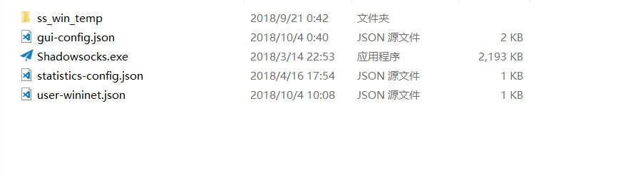
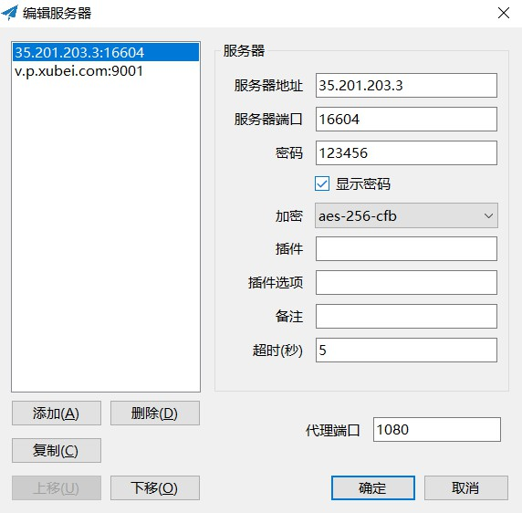

### 翻墙细则

1.下载连接远程服务器的软件

window系统

shadowsock-window (https://github.com/shadowsocks/shadowsocks-windows/releases/download/4.1.2/Shadowsocks-4.1.2.zip)

其他系统

其他系统 (https://github.com/shadowsocks)

2.安装shadowsock

下载完直接安装即可(__注意别安装在有中文路径的文件夹__)



3.设置远程服务器ip地址，端口号，密码

- 双击exe，然后出现设置画面,按照下面图片进行设置即可连接

- 右击右下角的shadowsock飞机图标, 把__启用系统代理勾上,系统代理模式设置为全局模式__

这样就可以翻墙进行访问了。

#### 注意事项

每次启动的时候点exe就可以，退出的时候有时候会出现访问不了baidu.com,出现这样的问题是因为浏览器的局域网代理没有勾选掉。这个时候需要

1.打开浏览器，找到设置，谷歌浏览器直接输入chrome://settings/ 就可以

2.设置里面高级设置里面有个选项，打开代理设置

3.点开打开代理设置有个局域网设置

4.把代理服务器的选项取消掉保存就ok了


#### 快速搭建ssr

```
wget --no-check-certificate -O shadowsocks-all.sh https://raw.githubusercontent.com/teddysun/shadowsocks_install/master/shadowsocks-all.sh
chmod +x shadowsocks-all.sh
./shadowsocks-all.sh 2>&1 | tee shadowsocks-all.log
```

然后出现下面这种情况

```
Congratulations, your_shadowsocks_version install completed!
Your Server IP :11.11.11.11
Your Server Port :8989
Your Password :123456
Your Encryption Method:aes-256-cfb

Welcome to visit:https://teddysun.com/486.html
Enjoy it
```


说明部署已完成.