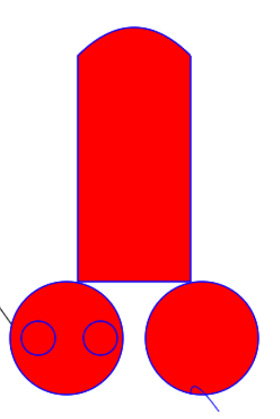

### 绘制形状

##### 1.绘制矩形

1.fillRect(x,y,width,height) 绘制一个填充的矩形

```
//绘制饱和的矩形
ctx.fillStyle = "red";  // 要先设置颜色最后再绘制
ctx.fillRect(0,0,100,100);  // 绘画一个矩形  (x,y,width,height)
```

2.strokeReact(x,y,width,height) 绘制一个矩形的边框

```
//绘制矩形边框
ctx.strokeStyle = "blue"; // 设置边框颜色
ctx.strokeRect(10,10,50,50); //绘制矩形边框  绘画一个矩形  (x,y,width,height)
```

3.clearReact(x,y,width,height) 清除指定矩形区域，让清除部分完全透明。

```
//清除指定矩形区域，并使其变得透明
ctx.clearRect(25,25,40,40);  // 清除指定矩形区域，让清除部分完全透明，绘画一个矩形  (x,y,width,height)
```

__前面3个我们发现一件事情，都没有stroke，因为在内部帮你实现了这个过程。__

4. moveTo 移动画笔 与 lineTo 绘制直线 

```
//绘制直线
ctx.moveTo(50,50);
ctx.lineTo(100,100);
ctx.color = "rgb(0,0,0)";
ctx.stroke();
```

5. beginPath() 新建一条路径 与 closePath() 闭合一条路径

```
//开始绘制路径
ctx.beginPath();
ctx.moveTo(100,100);
ctx.lineTo(150,150); 
//结束绘制路径并闭合
ctx.closePath();
//绘制
ctx.stroke();
```

##### 圆弧

1.arc(x,y,radius,startAngle,endAngle,anticlockwise) 绘制圆
2.arcTo(x1, y1, x2, y2, radius) 绘制圆弧

```
//开始绘制路径
ctx.beginPath();
ctx.moveTo(100,100);
ctx.lineTo(150,150);
// 绘制弧线,角度顺时针旋转 (x,y,radius,startangle,endangle,anticlockwise)
//x,y 对应中心点坐标，radius对应半径，开始的角度，结束的角度，反时针方向(默认为顺时针方向)
ctx.arc(75,75,50,Math.PI/2,Math.PI*2); // Math.PI对应的是180度
 //绘制弧线 (x1,y1,x2,y2,radius)
 //x1,y1对应的是开始的坐标，x2,y2对应的是结束的坐标，radius对应的是半径
ctx.arcTo(90,90,180,100,30);  
//结束绘制路径并闭合
ctx.closePath();
//绘制
ctx.stroke();
```

__注意：arc()函数中的角度单位是弧度，不是度数。角度与弧度的js表达式:radius=(Math.PI/180)*degrees。__


3.fill()  填充之前的绘制区域

4.quadraticCurveTo(cp1x,cp1y,x,y)

以画笔初始位置为起点，x为终点的x坐标，y为终点的y坐标，cp1x,cp1y为一个控制点来绘制二次贝塞尔曲线。

5.bezierCurveTo(cp1x,cp1y,cp2x,cp2y,x,y)

以画笔初始位置为起点，x为终点的x坐标，y为终点的y坐标，cp1x,cp1y为一个控制点,cp2x,cp2y为另一个控制点来绘制三次贝塞尔曲线。

```
// 绘制神州七号
ctx.beginPath();
ctx.color = "red";
ctx.moveTo(300,100);
ctx.lineTo(300,300);
ctx.lineTo(400,300);
ctx.lineTo(400,100);
ctx.quadraticCurveTo(350,50,300,100);
ctx.moveTo(340,350);
ctx.arc(290,350,50,0,Math.PI*2);
ctx.moveTo(280,350);
ctx.arc(265,350,15,0,Math.PI*2);
ctx.moveTo(335,350);
ctx.arc(320,350,15,0,Math.PI*2);
ctx.fill();
ctx.moveTo(460,350);
ctx.arc(410,350,50,0,Math.PI*2);
ctx.fill();
ctx.closePath();
ctx.stroke();
```

6.Path2D 用来缓存或记录绘画命令，相当于打包了一个对象，可以缓存该对象下面的所有路径

```
let _path2d = new Path2D();
_path2d.fillStyle = "yellow";
_path2d.rect(200,100,50,100);
ctx.stroke(_path2d);
```

完成后的截图应该是这样的.

