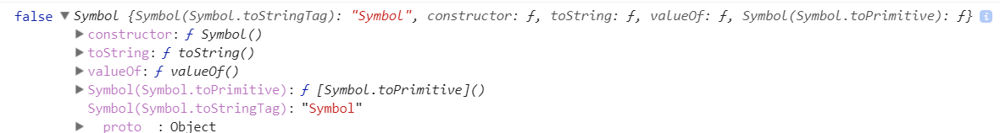

#### Symbol数据类型

Symbol是一种新的数据类型，他表示独一无二的值。前六种分别是：
Number, String, Boolean, Null, undefined, Object

Symbol也是通过函数(一等公民)生成的，所以对象的属性名有2种类型：

- 原来的字符串
- 新增的Symbol类型(独一无二的)

```
let s1 = Symbol();
let s2 = Symbol();
console.log(s1 === s2, s1.__proto__);
```



从上面的图片来看，Symbol函数有以下几个方法，

- constructor(构造函数)
- toString(转化为字符串)
- valueOf(获取该Symbol的值，并且类型为symbol,不能参与运算)

个人分析: 从内存的角度来看，每次调用Symbol函数都会创建一个value, 那我们能保证2个内存里面的值是一样的，但是
Symbol值不一样，那只能是js在进行解析的时候，保证每个通过Symbol创建的值的__指针是不同的。__(个人分析，错误勿喷)。

