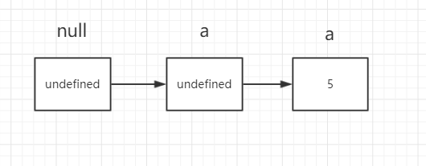

### 关于undefined 与null的一些故事情节

好多人对于undefined以及null都没有一个很清晰的认知。一般我们是这样理解的，
null表示什么都没有，而undefined表示有，但是值为空。

这样子的理解是没有错，但是不够具体。

我们接下来从几方面来剖析这两个东西，顺便也来理解一下关于javascript的故事。

我们知道js最开始是为了更好的处理脚本而编写的一个语言，但是问题来了。他的作者是怎么样要写这样一个东西。
我先说下我的个人见解，不喜勿喷。

其实，这个人他一开始也不知道怎么去下手去写一个编程语言，那怎么办呢，他就去模仿啊，对吧，找了lisp等好多编程语言
最后发现，他还是比较喜欢基于原型的这种方式来处理。啥叫原型呢?我们写js经常碰到这个问题，

__把一个东西copy一份，然后再在他的基础上加东西就叫基于原型，原来的模型。__

后来他就想找一个东西来开始，他就先创造了一个__空盒子 null__,然后所有的东西都是由这个null演变而来的。
因为null是一个对象，而基于他的所有东西也都是对象，所以为什么说万物皆对象，大概就是这个道理。原型链的源头
也是这个家伙也是这个道理。

```
						number string boolean undefined
null --->  Object -->
						array  object
```

所以null 本质是一个空的内存，里面什么都没有，由于js会自动回收空的内存，所以，你把一个变量赋值为null,就相当于
把一个本来是有东西盒子清空了所有，然后会被自动回收。

但是这样设计会有一些问题，假如一些有对象，但是值是空的，怎么办，而且很重要的一点，null本身是一个对象。
让一个空值 === 一个空对象，不太好，然后就有了undefined这个玩意。

```
Number(null);NaN
Number(undefined); NaN
```

首先我们可以看看官方文档给出的undefined的定义，

```
A primitive value is a datum that is represented directly at the lowest level of the language implementation.
// 原始值是在语言实现的底层直接表示的数据，等同于常量

undefined value
primitive value used when a variable has not been assigned a value.
 //当一个变量没有被赋值时使用的原始值
 
 null value
 primitive value that represents the intentional absence of any object value
 //代表对象值故意设为底层的原始值
```

我们再从另外一个方面来看，我们定义任何的变量，如果不赋值，初始值都是undefined，根据原型链的理解
变量又是基于null演变而来的。下面这个是我自己的猜测，因为在null.valueof()是被拦截报错的

```
var a; //对应下图从第一步到第二步
a = 5; // 对应下图从第二步到第三步
```



这里顺便也可以提一下函数的返回值为什么也是undefined，

__一个函数其实也是对应一个内存地址__


```
function foo() {
	console.log('foo');
}; //  函数其实跟定义变量一样，分配一块内存地址，只不过没有实例化的函数，没有一个对应的指针对象,所以函数的返回值依旧是undefined
```

总结一下，

给一个全局变量赋值为null，相当于将这个对象的指针对象以及值清空，如果是给对象的属性
赋值为null，或者局部变量赋值为null,相当于给这个属性分配了一块空的内存，然后值为null(primitive vlaue)，
js会回收全局变量为null的对象

给一个全局变量赋值为undefined，相当于将这个对象的值清空，但是这个对象依旧存在,如果是给对象的属性赋值
为undefined，说明这个值为空值