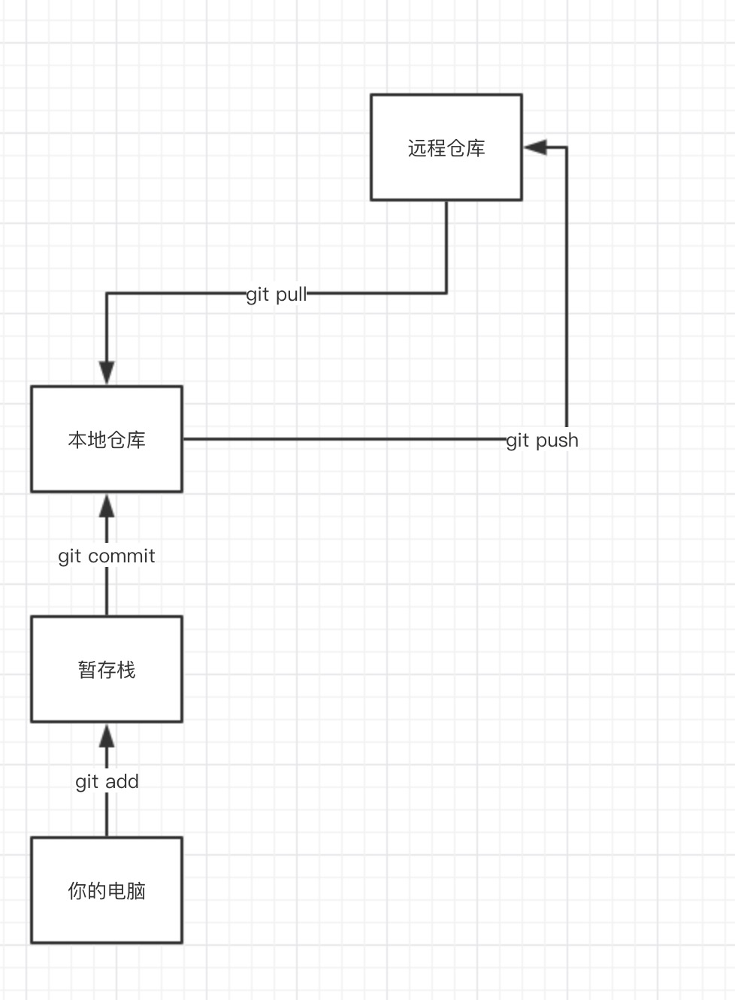

###  git 使用操作

git是一个版本管理工具。



简单介绍：
我们要把本地的代码推送到远端的仓库，并进行更新管理，这个时候，我们正常要做的几步操作

1. git add [文件名]  (无脑操作可以 git add ./ 添加所有的文件)

将本地的电脑代码提交到暂存栈里面


2. git commit -m "更新什么东西"  把暂存栈与本地仓库进行一个对比，并说明修改了哪些文件


3. git pull 把远程仓库代码拉取到本地并进行合并


4. git push 把本地仓库最新的代码推送到远程仓库并进行更新

##### 拉取远程仓库代码

git clone [git 地址] 

比如  git clone https://github.com/qipiaoyang/orangeDemo.git

#### 如何去更新本地代码

先进行 git pull ,拉取到本地仓库，最好也git push 一下


#### 提交本地代码


无脑按以下几步去走就好
```
git add ./
git commit -m "更新"
git pull
git push
```