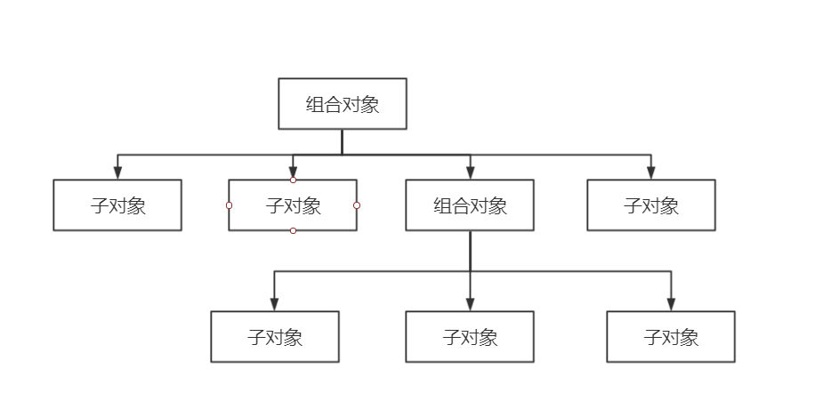

### 组合模式

组合模式: 将对象组合成树形结构，以表示“部分——整体”的层次结构，而且还可以通过对象的多态性表现
使得单个对象与组合对象的使用具有一致性。

#### 回顾宏命令

我们知道宏命令是一个对象把对应的子命令收集起来，然后进行执行。这样我们会发现形成了一个树的形状。



```
var command1 = {
		excute: function() {
			console.log("我是命令第二层1");
		}
	};
	var command2 = {
		excute: function() {
			console.log("我是命令第二层2");
		}
	};
	var command3 = {
		excute: function() {
			console.log("我是命令第二层3");
		}
	};
	var command4 = {
		excute: function() {
			console.log("我是命令第一层1");
		}
	};
	var command5 = {
		excute: function() {
			console.log("我是命令第一层2");
		}
	};
	var MacroCommand = function() {
		return {
			commandList:[],
			add: function(command) {
				this.commandList.push(command);
			},
			excute: function() {
				for(var i = 0, len; len = this.commandList[ i++ ];) {
					len.excute();
				}
			}
		}
	};
	var MacroCommand1 = MacroCommand();
	MacroCommand1.add(command1);
	MacroCommand1.add(command2);
	MacroCommand1.add(command3);
	var MacroCommand2 = MacroCommand();
	MacroCommand2.add(MacroCommand1);
	MacroCommand2.add(command4);
	MacroCommand2.add(command5);

	MacroCommand2.excute(); // 我是命令第二层1 , 我是命令第二层2 ,我是命令第二层3, 我是命令第一层1, 我是命令第一层2 
```

从上面的代码我们可以看出来，组合模式是将对象组合成树形结构，然后请求在树中的传递过程，总是遵循一种逻辑(方便递归);
然后上面代码的执行顺序与二叉树的执行顺序其实是不一样的。组合模式的执行顺序是从__上往下，从左往右__的一个执行顺序。