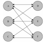
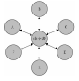

### 中介者模式

面向对象设计鼓励将行为分布到各个对象之中，但是对象与对象之间经常有或多或少的联系，这样经常会产生很复杂的
关系。这个时候如果有一个中央调度系统来调度就很舒服了。

中介者模式的作用就是解除对象与对象之间的紧耦合关系，把__多对多的关系变成一对多的关系__。

```
//创建玩家
function player(name,teamColor) {
	this.name = name;
	this.teamColor = teamColor;
	this.state = 'alive';
}
var playerFactory = function(name,teamColor) {
	var newPlayer = new player(name,teamColor);
	playerDiretor.reciveMessage("addPlayer",newPlayer);
	return newPlayer;
}
// 移除玩家
player.prototype.remove = function() {
	playerDiretor.reciveMessage('removePlayer', this);//给中介者发消息，这位玩家已经死亡
}
var playerDiretor = (function() {
	var players = {}, // 保存所有玩家
		operations = {};
	// 新增一个玩家方法
	operations.addPlayer = function(player) {
		var teamColor = player.teamColor;
		players[teamColor] = players[teamColor] || [];
		players[teamColor].push(player);
	}
	// 移除一个玩家
	operations.removePlayer = function(player) {
		var teamColor = player.teamColor,
			teamPlayers = players[teamColor] || [];
		for(var i = teamPlayers.length - 1; i >= 0; i--) {
			if(teamPlayers[i] === player) {
				teamPlayers.splice(i,1);
			}
		}
	}
	var reciveMessage = function(){
		var message = Array.prototype.shift.call(arguments);
		operations[message].apply(this,arguments);
	}
	return {
		reciveMessage: reciveMessage
	}
})();
var xiaohong = playerFactory("xiaohong","blue"); //给blue战队新增xiaohong
var xiaolan = playerFactory("xiaolan","red"); //给red战队新增xiaolan
var xiaolv = playerFactory("xiaolv","blue");//给blue战队新增xiaolv
xiaolv.remove();//移除blue战队的xiaolv
```

上面的例子就是把添加玩家，移除玩家的功能全部交给中介者playerDiretor去处理。把



变成



##### 小结

中介者模式是迪米特法则的一种实现。迪米特法则也称最少知识原则，是指一个对象应该尽可能少的了解另外的对象。
但是缺点也是很明显，需要维护一个臃肿的中介者对象。