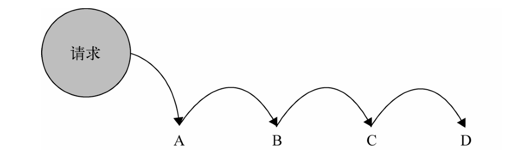

### 职责链模式

职责链模式的定义: 使多个对象都有机会处理请求，从而避免请求的发送者与接收者之间的耦合关系，将
这些对象连成一条链，并沿着这条链传递该请求，直到有一个对象处理他为止。

```
var order500 = function(orderType, pay, stock) {
	if(orderType === 1 && pay === true) {
		console.log('500元定金预购，得到100优惠券');
	} else {
		return "nextNode";
	}
}
var order200 = function(orderType, pay, stock) {
	if(orderType === 2 && pay === true) {
		console.log('200元定金预购，得到50优惠券');
	} else {
		return "nextNode";
	}
}
var orderNormal = function(orderType, pay, stock) {
	if(stock > 0) {
		console.log('普通购买，无优惠券');
	} else {
		console.log('手机库存不足'); // 结束条件
	}
}
var protochain = function(fn) {
	this.fn = fn;// 缓存函数
	this.nextNode = null; //设置下一个节点
};
protochain.prototype.setNextNode = function(nextNode) {
	this.nextNode = nextNode; 
}
protochain.prototype.connect = function() {
	var ret = this.fn.apply(this,arguments);
	if(ret === "nextNode") {
		return this.nextNode && this.nextNode.connect.apply(this.nextNode,arguments);//返回下一个节点，并且执行
	}
	return ret;
}
//创建节点
var order200Node = new protochain(order200);
var order500Node = new protochain(order500);
var orderNormalNode = new protochain(orderNormal);
//设置顺序
order500Node.setNextNode(order200Node);
order200Node.setNextNode(orderNormalNode);
order500Node.connect(2, false, 3);//从第一个节点开始触发
```

上面就是一个职责链模式的案例，通过上面的案例我们会发现职责链，就是把一个复杂的问题拆分成一个个简单的
问题，然后通过一条线连接起来。但是有几个点需要注意

1.每一个功能模块之间有一个共同的连接点，上面的案例是通过结果nextNode来传递的。
2.参数具有普适性，能在每一个功能模块都能适用。

#### 职责链处理前后的图例




#### 职责链模式的优缺点

职责链模式的优点是把一个复杂的问题拆分为一个个功能模块，然后你可以通过自行拼装组合来达到想要的目的，
符合单一职责原则。

职责链模式的缺点是会创建一个个节点对象，在处理的过程中，会有很多节点没有起到实质性的作用，造成性能上的缺失。

#### 职责链模式与promise的关系

promise其实里面就有职责链模式的存在，每一个方法之间通过then方法来进行传递，上面的案例
只有成功或者失败两种状态。但是promise存在三种状态，一个进行中、完成、拒绝。同样promise
会造成性能上的浪费。promise的返回值可以是一个promise对象或者任何值。


#### 面向切面实现职责链模式

```
Function.prototype.after = function(fn) {
	var self = this;
	return function() {
		var ret = self.apply(this,arguments);
		if(ret === "nextNode") {
			fn.apply(this,arguments);
		}
		return ret;
	}
}
var order = order500.after(order200).after(orderNormal);
order(2, false, 3);
```

#### 总结

职责链模式可以降低请求的对象与处理请求的对象之间的耦合性，并且之间的顺序是可以灵活组合的。

