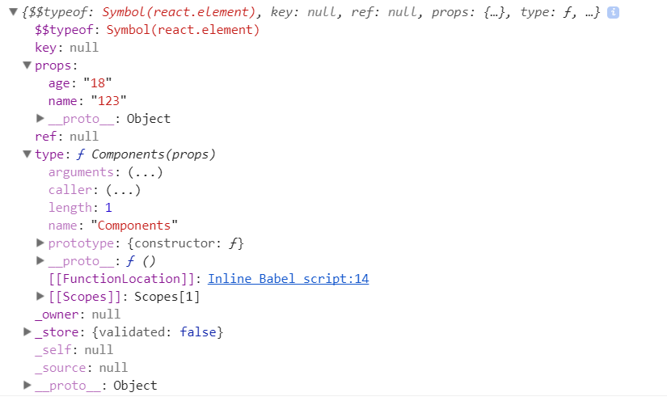

### 关于react的组件

无论是react还是vue或者是angular经常谈论的就是组件化。那么何为组件化。

从中文的解释上看，就是一堆零件组合起来叫组件。
组件可以将UI切分成一些的独立的、可复用的部件，这样你就只需专注于构建每一个单独的部件。
我相信没有人再愿意把一个前端模块复制几十遍。前端组件化开发已经是必要条件了。

#### react实现组件化的三种方式   无状态组件 ， 有状态组件(createClass,Component)

__react的组件是无法继承的,即不存在React.extend之类的方法可以定义一个子类。__
__react推崇通过组合的方式来组织大规模的应用。__

#### 1. 无状态组件

我们知道react是通过jsx来描述页面的。jsx从某种意义上来说就是一个变量。
无状态组件创建的方式就是通过函数/类的方式来定义组件

```
function Components(props) {
	return <span>我是一个函数式组件 {props.name}</span>;
}
ReactDOM.render(
	<p>
		{console.log(<Components name='123' age="18" />)}
		<Components name='123' age="18" /> //这里也可以写成Components({name:"123",age:"18"}),为什么不这样写后面会说到  
	</p>,	
	document.getElementById('root'),
);
```

上面这个例子就是通过函数的方式来创建一个组件，这样的写法有个好处就是
函数没有在实例化的时候是没有指针对象的，所以不需要分配多余的内存，从而在性能上得到一定的提升。

但是由于是通过函数来创建的，所以无状态组件是不能访问this的，所以ref，state都是不能获取，生命周期也是不能获取的。
组件只有一个入口就是props，不会有其他的副作用。

因为react的组件是通过组合的方式来组织大规模的应用的，所以我们我们可以用无状态组件来表示的时候，一定要用。这样可以节省很多的开销。

上面我打印了一下这个组件，然后得到下面的结果。



这里有几个信息，在查看源码的时候可以关注一下

1.type 组建的type表示组建的标签名

2.props 组建的属性都会挂载在这个props对象里面

3.ref 提供了一种访问在 render 方法中创建的 DOM 节点或 React 元素的方式。

4.key 渲染相同组件的时候作为区分的条件


#### 2.有状态组件


