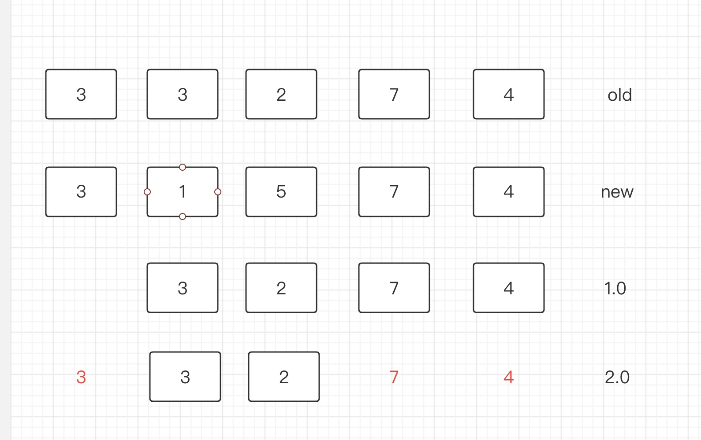

### vue的diff算法

#### patch过程

简单来说就是：n1 代表旧节点，n2代表新节点

1. 如果是单VNode对比：
    1.1 n1为空，则创建n2

    1.2 n2为空，则删除n1

    1.3 n1的类型与n2不一致，则 删除n1创建n2.

    1.4 n1与n2一致，则patch，判断其patch其props，class，attr，进行dom操作
2. 如果是多节点，且是无key形式
    2.1 取n2与n1最小长度遍历：使用patch处理

    2.2 如果n1多出来的：unmountChildren

    2.3 如果n2多出来的：进行mountChildren

3. 如果是多节点，有key形式
    3.1 先从开头遍历，类型一致则patch，发现类型不一致则停止。如 (a b) c与(a b) d e

    3.2 从尾开始遍历，类型一致则patch，发现类型不一致则停止。 如a c (d f)与b a (d f)

    3.3 处理n2两头多出来的部分， 直接mount。如b c与(a) b c或者 b c与b c (d)

    3.4 处理n1两头多出来的部分， 直接删除。如(a) b c与b c或者b c (d)与b c

    3.5 处理n1与n2 中间遗留的如b (e f g h) c与b (f g k h) c。

    3.5.1 将n2中间的 f g k h生成Map

    3.5.2 遍历n1中间的(e f g h)

    3.5.2.1 遍历过程中发现不在n2中，则直接删除。

    3.5.2.2 遍历过程中发现在n2中，则直接patch。并记录n2中位置。后面需要移动位置。

    3.6 对于n2中间的 f g k h新增的如k 进行mount。

    3.7 对于3.5.2.2中的进行移动位置。

    我们就知道了,如果有key的话，会通过key筛选，从而明确哪个节点删除/替换/移动尽可能的减少dom操作。但是没有key的话，只能通过遍历，相对而言这种操作dom的情况较多。
    比如：a b c d e f 与 b c d e f
    这种形式会导致，每个节点都要进行调整操作dom。

