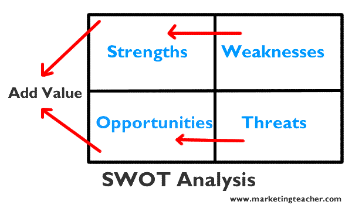

## 营销要点

### 1.什么是营销？营销的定义。

__营销是个人和组织通过创造和与他人交换价值来获得他们需要和想要的东西的社会过程.__(价值互换的一个过程)

当然，营销只是一种过程，价值是结果，这个结果可以是直接的金钱或者是客户关系等等。

营销是一种活动，一系列机构，以及创建，交流，交付和交换对客户，客户，合作伙伴和整个社会都有价值的产品的过程。(__一切都是营销__)

### 2.SWOT分析

swot分析要清楚我们营销对象的几个特点：

- 产品优势
- 产品劣势
- 机遇
- 风险

优点以及缺点是内部因素，机遇与风险是外在因素。我们的目标就是把我们的弱点转化为优势，将我们的风险转化为机遇。
最终我们将内部优势与外部机会想匹配的选项为客户增加价值。

分析的目的是必须为我们的产品以及服务增加价值。

### 3.五力分析

五种力量分析着眼于五个关键领域

    #### 3.1 入行的威胁

    - 规模经济，例如与批量采购相关的收益。
    - 入门成本高或者低成本，例如最新数字技术的成本是多少？
    - 易于访问分销渠道，例如我们的竞争对手是否有分销渠道？
    - 成本优势与公司规模无关，例如个人联系或大公司不拥有的知识或学习曲线效应
    - 竞争对手会报复吗？

    #### 3.2 买家的议价能力

### 分析的一些简单规则

- 优势与劣势一定要切合实际应用场景。(偏离应用场景的优势，劣势是无用的)
- 清楚的知道产品现在的定位以及未来最高会处于什么样的位置
- 营销一定要有实际的产品，避免灰色区域。
- swot分析的结果要对比竞争对手，哪些比别人好，或者哪些比别人差。
- 尽量切合实际应用场景，不要想的过于复杂或者过度设想
- 所有的分析都是主观判断，需要善于采纳他人建议。
